<p align="center">
  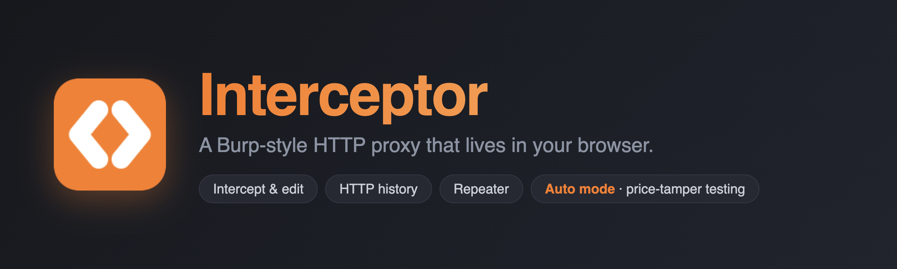
</p>

<p align="center">
  <b>See, edit, replay and auto-tamper the HTTP your web app sends — right inside your browser.</b><br>
  A lightweight, Burp-style proxy as a Chromium extension. No proxy setup, no certificates, no external app.
</p>

<p align="center">
  
  
  
  
</p>

---

## What is this?

**Interceptor** is a browser extension for web developers and security testers who want to inspect and manipulate their own app's traffic without leaving the browser. It's the everyday 20% of Burp Suite — intercept, history, and repeater — plus one thing Burp makes you do by hand: **Auto mode**, which rewrites chosen fields (like a payment `amount`) on every request automatically, so you can test server-side validation in seconds.

Because it's built on the Chrome DevTools Protocol, it can truly **pause, edit, forward, and drop** live requests and responses — something a normal `webRequest` extension cannot do.

> ⚠️ **Use it on apps you own or are authorized to test.** See [Responsible use](#responsible-use).

## Features

- 🧲 **Intercept** — pause requests (and responses) and edit the raw method, path, query, headers or body before they continue. Forward, drop, or forward-and-catch-the-response.
- 📜 **HTTP History** — a live table of every request from the target tab, with full headers (including `Cookie`/`Set-Cookie`), bodies, timing and size. Search URLs, headers, and bodies; filter by method/status/type; import or export **HAR**.
- 🔁 **Repeater** — hand-craft a raw request and fire it as many times as you like. What you type is exactly what goes on the wire — including `Cookie`, `Origin`, `User-Agent` and `Sec-*` headers.
- 📥 **cURL import** — paste a command from DevTools to create an editable Repeater request. Nothing executes or sends during import.
- 🗂️ **Collections & variables** — organize named requests in folders with notes. Reuse `{{host}}`, `{{baseUrl}}`, or your own variables across Repeater and Runner. Import/export portable collections and optionally keep the workspace locally.
- 🧪 **Runner** — replace a value with `{{payload}}`, try up to 50 values sequentially, and inspect status, timing, size, and response-text checks. Cancel a run, export CSV, or compare results.
- 🗺️ **Site Map** — group captured requests into endpoints by origin, method, and path. See call counts, statuses, timing, and query field names; jump back to History or replay an endpoint.
- 🔎 **Inspector** — read query/form fields, nested JSON values, request cookies, response headers, and `Set-Cookie` attributes. Send any field to Decoder.
- ⚡ **Auto mode** — force one or more fields to a fixed value automatically. Limit changes with URL include/exclude patterns, then run against **this tab** or **all tabs** from the toolbar popup.
- ⚖️ **Comparer** — send responses from History or Repeater into a side-by-side line diff, with optional JSON normalization and a copyable unified diff.
- 🔓 **Decoder** — JSON, URL, Base64, hex, HTML entities, JWT inspection, and SHA-256/SHA-512 hashes, all locally.
- 🕘 **Response snapshots** — Repeater retains the last five responses for each tab and compares successive sends. Set a request timeout and duplicate requests with one click.
- 🧩 Works in **Brave, Chrome and Edge**. Pure JavaScript, **no build step**, no dependencies, no data leaves your machine.

## Screenshots

<table>
  <tr>
    <td width="50%">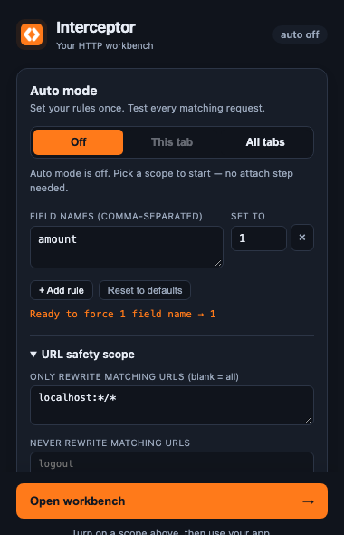<br><sub><b>Toolbar popup</b> — flip Auto mode on for this tab or all tabs.</sub></td>
    <td width="50%">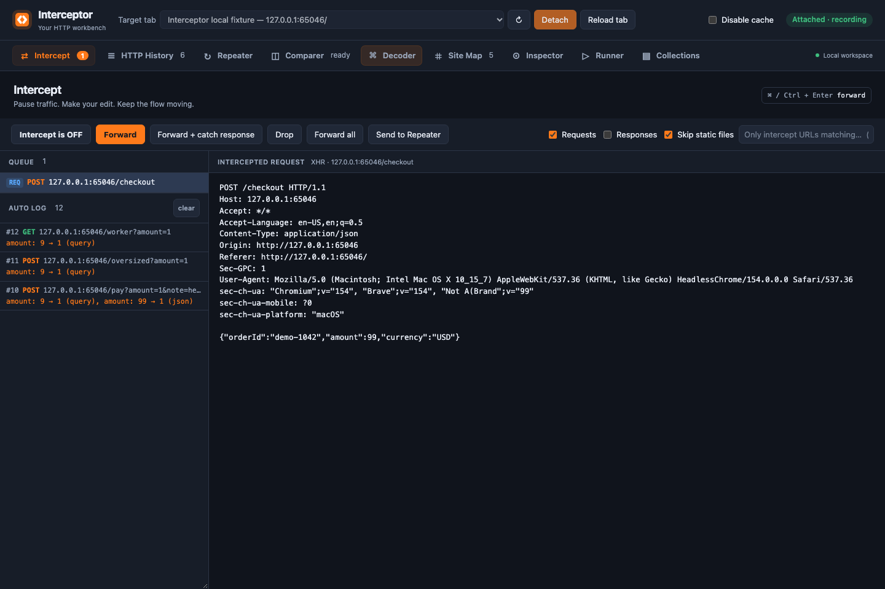<br><sub><b>Intercept</b> — a paused request, with the Auto-mode rewrite pre-applied.</sub></td>
  </tr>
  <tr>
    <td width="50%">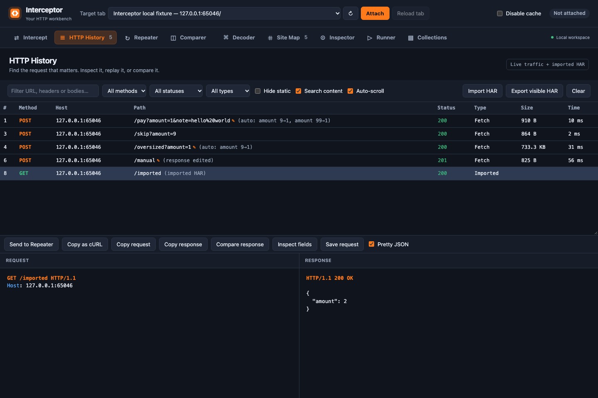<br><sub><b>HTTP History</b> — full request/response, copy as cURL, export HAR.</sub></td>
    <td width="50%">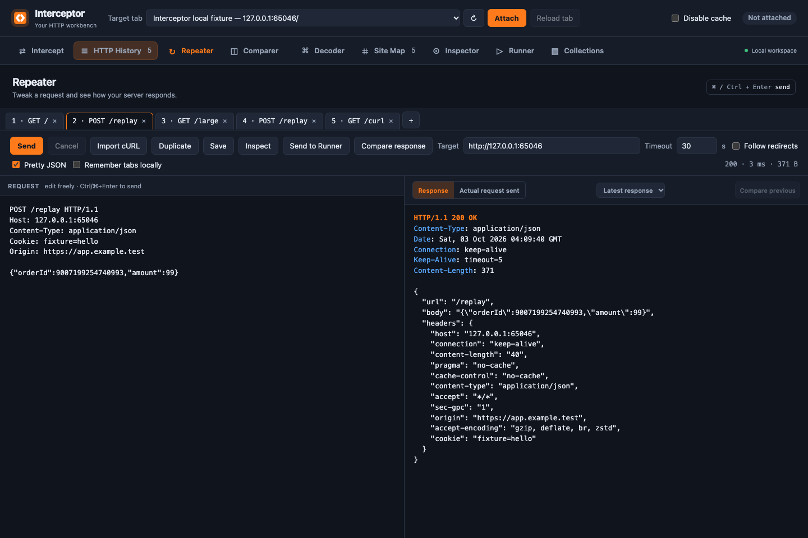<br><sub><b>Repeater</b> — edit a raw request and replay it.</sub></td>
  </tr>
  <tr>
    <td width="50%">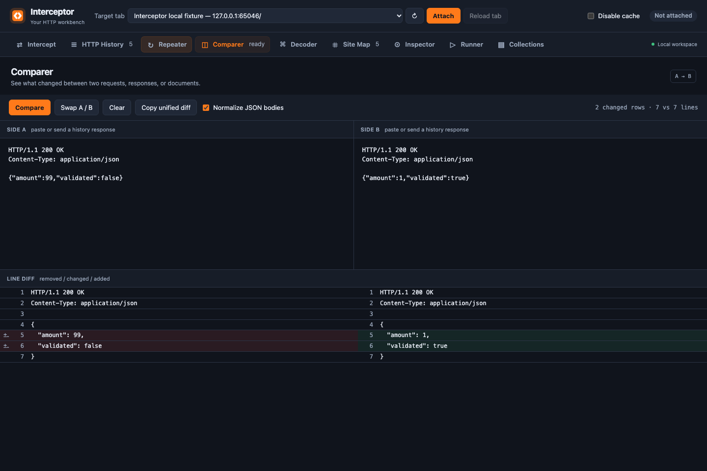<br><sub><b>Comparer</b> — spot the changed fields.</sub></td>
    <td width="50%">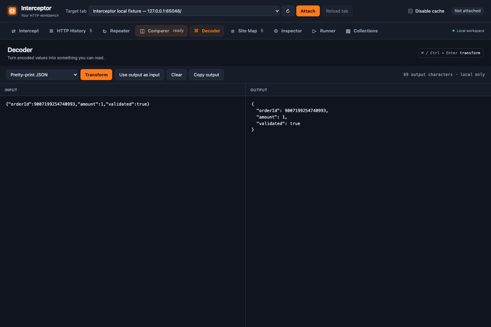<br><sub><b>Decoder</b> — inspect and transform encoded values.</sub></td>
  </tr>
  <tr>
    <td width="50%">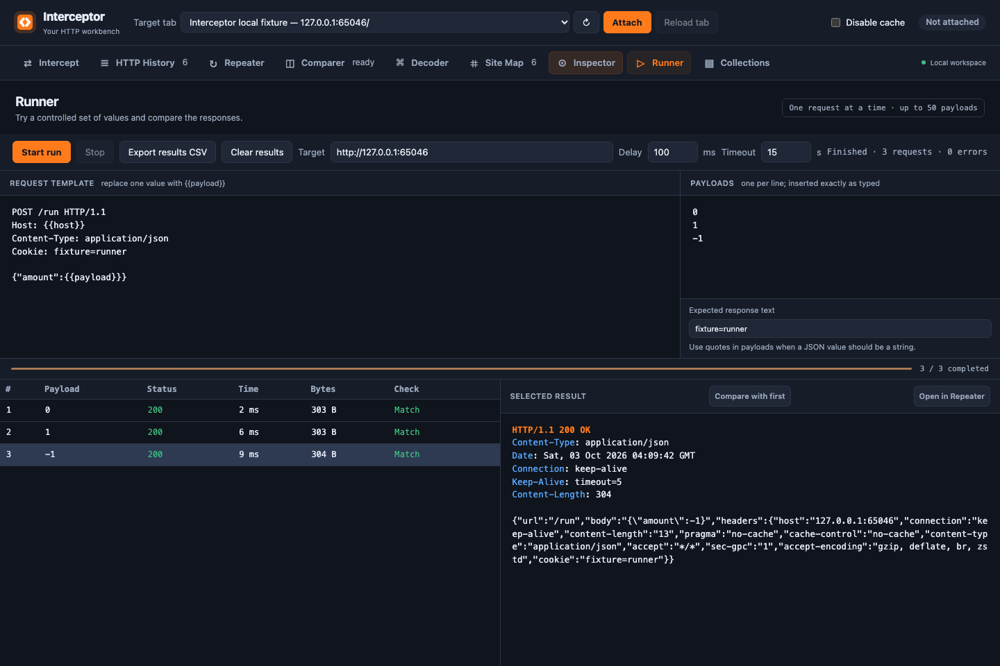<br><sub><b>Runner</b> — repeat validation tests with different values.</sub></td>
    <td width="50%">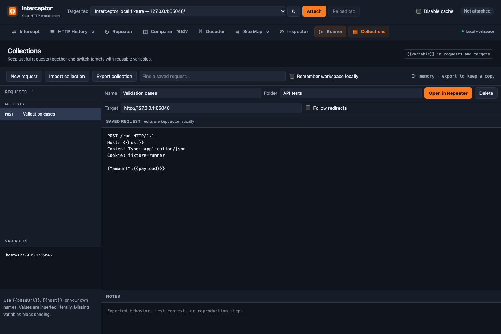<br><sub><b>Collections</b> — organize requests and reusable variables.</sub></td>
  </tr>
  <tr>
    <td width="50%">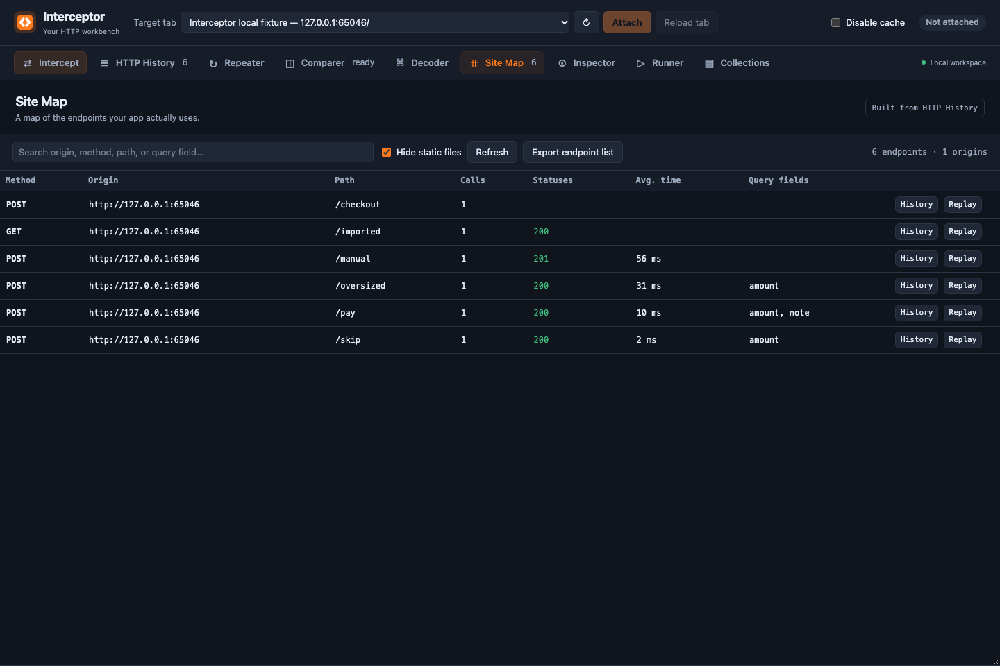<br><sub><b>Site Map</b> — understand the API your app uses.</sub></td>
    <td width="50%">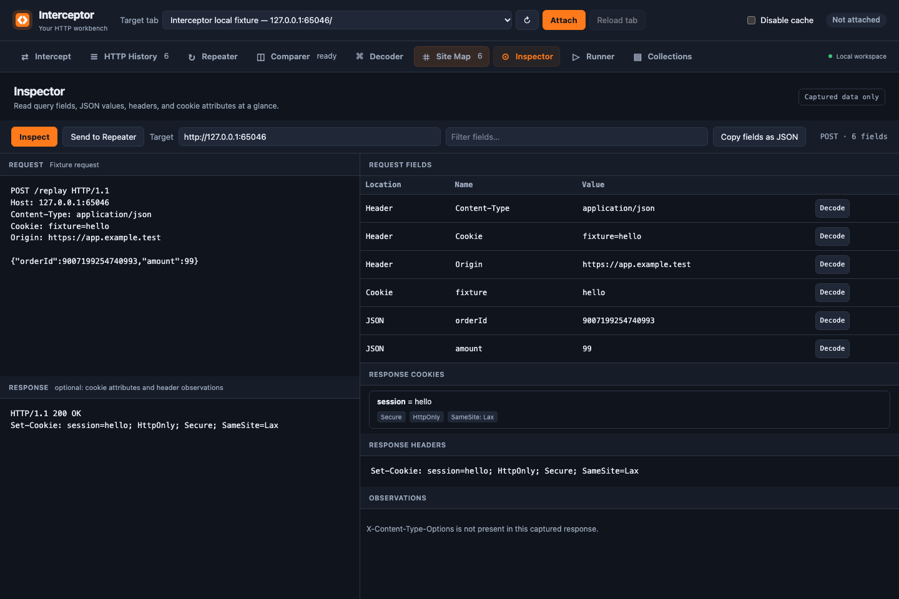<br><sub><b>Inspector</b> — read fields and cookie attributes.</sub></td>
  </tr>
</table>

## Install (from source)

Install [Interceptor from the Chrome Web Store](https://chromewebstore.google.com/detail/jlckafabkmodidmgpkghjihifieibfgg), or load the source unpacked in about a minute:

1. **Download** this repo (`git clone` or *Code → Download ZIP* and extract).
2. Open your browser's extensions page:
   - Brave: `brave://extensions`
   - Chrome: `chrome://extensions`
   - Edge: `edge://extensions`
3. Turn on **Developer mode** (top-right).
4. Click **Load unpacked** and select the project folder.
5. Pin **Interceptor** to the toolbar. Done.

```bash
git clone https://github.com/user-github-me/interceptor.git
# then "Load unpacked" → select the interceptor/ folder
```

## Quick start

### Test a payment flow in 15 seconds (Auto mode)

1. Click the **Interceptor** toolbar icon.
2. Under **URL safety scope**, add your local or staging URL, such as `localhost:*/*` or `*.staging.example.com/api/*`.
3. Choose **All tabs** (or **This tab**). The default rule already forces common payment fields to `1`.
4. Use your app's checkout. Every in-scope `amount`, `payableAmount`, `totalAmount`, … goes out as `1`.
5. Check your server: did it re-price server-side, or did it trust the client? If the order total drops, your validation is bypassable.

Open the panel to see rewrites in the **Auto log**. Attach to the app's tab to also record its full **HTTP History**.

### Inspect & tamper by hand (Intercept)

1. Click **Open workbench →** in the popup and pick your app's tab under **Target tab**, then **Attach**. Your browser shows an *"Interceptor started debugging this browser"* banner — that's expected; it's how the extension gets low-level access.
2. Click **Intercept is OFF** to turn it **ON**.
3. Use your app. Requests pause in the queue — edit anything and **Forward** (⌘/Ctrl+Enter), or **Drop** them.

## How it works

### Reusable validation tests

1. Send a captured request to **Repeater**, or use **Import cURL** to bring one in from DevTools.
2. Save it to **Collections** and add a name, folder, and reproduction notes.
3. Set workspace variables as `name=value`, one per line. For example, `host=localhost:3000` can be used as `Host: {{host}}` in a saved request.
4. Click **Send to Runner**. Replace the value you want to vary with `{{payload}}`, then put one value on each line in **Payloads**. Values are inserted literally; include quotes for JSON strings or URL encoding for query values.
5. Set the delay and timeout, then **Start run**. Each result can be opened in Repeater or compared with the first result. Starting the run sends all listed requests to the chosen target.

Runner uses one origin per run, sends one request at a time, and follows no redirects. It checks literal response text when you supply an expected value. **Stop** cancels the current request and remaining payloads. Missing variables block sending. Collections exports include request text but omit workspace variables; raw requests may still include credentials you pasted.

Use **⌘/Ctrl+K** to jump to any workbench tool.

## Architecture

Interceptor is built on the **Chrome DevTools Protocol (CDP)** via the `chrome.debugger` API — the only way an extension can genuinely pause and mutate live traffic (the `webRequest` API can observe and block, but not rewrite bodies or edit responses).

```
┌───────────────────────────┐        ┌──────────────────────────────┐
│  Toolbar popup (popup.js)  │        │  Dashboard page (dashboard.js)│
│  • Auto mode on/off        │        │  • Intercept queue + editor   │
│  • scope: this tab / all   │        │  • HTTP history + HAR         │
│  • field → value rules     │        │  • Repeater + HAR import      │
│  • URL safety scope        │        │  • Comparer + Decoder         │
└─────────────┬─────────────┘        └───────────────┬──────────────┘
              │ chrome.storage                        │ CDP: Fetch + Network
              ▼                                        ▼  (its own debuggee)
┌─────────────────────────────────────────────────────────────────────┐
│  Background service worker (background.js)                            │
│  • Owns Auto mode: attaches the debugger to the target tab(s)         │
│    automatically and rewrites fields via CDP "Fetch.requestPaused"    │
│  • Survives service-worker idle (debugger sessions persist)           │
│  • Hands a tab off to the dashboard when you attach manually          │
└─────────────────────────────────────────────────────────────────────┘
                                   │
                                   ▼
                    http.js — dependency-free engine:
                    raw HTTP parse/serialize, cURL/HAR,
                    and the field-rewrite rules (query, form,
                    nested JSON, multipart; type-preserving)
```

- **Auto mode** runs entirely in the background service worker, so it needs no open panel and can cover every tab. Attaching the debugger from the worker keeps working even after the worker goes idle.
- **Manual intercept/history/repeater** run in the dashboard page, which holds its own debugger session. When you attach it to a tab, it "claims" that tab and the worker steps aside — coordinated through a single serialized queue so the two never fight over one tab.
- **`http.js`** has zero DOM/`chrome.*` usage, so the whole request-rewriting engine is unit-tested in plain Node.

### Auto mode rules

Each rule is a list of **field names** (comma-separated) plus one **value**. A field is rewritten wherever it appears in:

| Location | Example |
|---|---|
| Query string | `?amount=4999` → `?amount=1` |
| Form body (`x-www-form-urlencoded`) | `amount=4999` → `amount=1` |
| JSON body (including deeply nested) | `{"order":{"amount":4999}}` → `{"order":{"amount":1}}` |
| Multipart form fields | `name="amount"` part value → `1` |

Matching is **case-insensitive on the whole field name** (`AmountToPay` matches `amountToPay`), a field you didn't list (like `quantity`) is left untouched, and JSON types are preserved (a numeric field stays a number). The default rule covers the usual suspects: `amount, payableAmount, payingAmount, amountToPay, paymentAmount, totalAmount, grandTotal, orderTotal, subtotal, price, unitPrice, amountDue, netAmount, finalAmount, chargeAmount, billAmount, totalPrice, payment` — add your app's own field names in the popup.

Use **URL safety scope** to constrain those rules. Each line can be plain text, a glob such as `*.example.test/api/*`, or a regular expression such as `/^https:\/\/api\.example\.test\//i`. Globs match the whole URL, or the host and path when you omit the scheme. Plain text matches anywhere in the URL. Regex flags `i`, `m`, `s`, and `u` are supported. A blank include list allows all HTTP(S) URLs; exclusions always win. Invalid patterns pause automatic rewriting until fixed. Tab-only targets live in session storage, so a browser restart cannot accidentally reuse an old tab ID.

## Permissions

| Permission | Why |
|---|---|
| `debugger` | The core: pause, edit, forward and drop live requests/responses via CDP. |
| `tabs` | List tabs to target and coordinate attach/detach. |
| `storage` | Remember settings and rules; Repeater tabs, Collections, and variables only when local persistence is enabled. |
| `webRequest` | Show the *"Actual request sent"* view in Repeater. |
| `declarativeNetRequestWithHostAccess` | Let Repeater send otherwise-forbidden headers (`Cookie`, `Origin`, `User-Agent`, …) exactly as typed. |
| `clipboardWrite` | Copy raw messages, cURL commands, decoded output, and diffs when you click a copy button. |
| `<all_urls>` | You decide which of *your* sites to test; traffic never leaves your machine. |

There are no analytics or telemetry. Traffic is processed locally; Repeater sends requests only to the target you choose.

## Limitations

- One **manually-attached** tab at a time for the deep intercept/history/repeater workflow (Auto mode can cover all tabs).
- WebSockets and Server-Sent Events aren't intercepted.
- Bodies are edited as UTF-8 text; binary and oversized bodies are passed through unchanged. History keeps up to 2,500 entries, 750,000 characters per body, and a 64-million-character total text budget. Repeater previews up to 4 MB per response.
- Repeater drafts stay in memory by default. Enable **Remember tabs locally** to keep them across panel sessions; existing saved drafts are preserved on upgrade.
- Collections and variables stay in memory unless **Remember workspace locally** is enabled. Runner is limited to 50 payloads and keeps capped response previews. Site Map covers recorded/imported traffic; it does not crawl sites.
- cURL import supports literal URLs, method, headers, body, cookies, Basic auth, and redirects. Unsupported options and file uploads are rejected instead of silently omitted.
- Browsers can't send a body with `GET`/`HEAD`, so Repeater can't either.
- Traffic from other-process iframes and some service workers may not be captured.
- For a self-signed HTTPS dev cert, open the URL in a tab and accept it once before using Repeater.

## Development & tests

Pure JS, no build and no runtime dependencies. Run the tracked Node test suite and syntax checks with:

```bash
npm test
npm run check
```

The browser integration check uses a local echo server and an isolated Chromium
profile with the unpacked extension loaded and remote debugging enabled:

```bash
node tests/browser-integration.mjs http://127.0.0.1:9226
```

It checks debugger attachment, request/response edits, Auto scope and worker
handoff, Repeater headers and rule cleanup, response limits, HAR import,
Inspector, Site Map, variables, Runner cancellation, snapshots, and workspace persistence.

```
manifest.json      MV3 manifest
background.js      service worker — Auto mode engine + tab coordination
popup.html/.js/.css  toolbar popup — Auto mode scopes & rules
dashboard.html/.js/.css  the panel — intercept, history, repeater, comparer, decoder
http.js            dependency-free HTTP + rewrite engine (unit-tested)
workbench.js       HAR import, comparer, and decoder helpers
workflow.js        cURL import, variables, endpoint mapping, and inspection helpers
workflow-ui.js/.css collections, Inspector, Site Map, Runner, and tool switcher
tests/             Node tests for parsing, rewriting, scope, HAR, diff, and codecs
icons/             extension icons
docs/screenshots/  images used in this README
```

## Responsible use

This is a tool for testing **your own** applications, or ones you have **explicit permission** to test. Intercepting or tampering with traffic to services you don't control may be illegal and is not the intent of this project. You are responsible for how you use it.

## Contributing

Issues and PRs are welcome — bug reports, new default field names, and UI polish especially. Keep it dependency-free and match the existing style. If you change the rewrite engine, add a unit test in the same spirit as the existing ones. Work on a feature branch and submit a pull request; updates are reviewed before merging into `main`.

## License

[MIT](LICENSE) — do what you like, no warranty.
